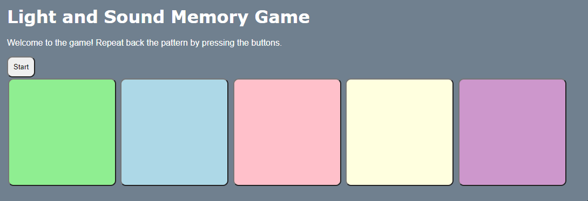

# Pre-work - *Memory Game*

**Memory Game** is a Light & Sound Memory game to apply for CodePath's SITE Program. 

Submitted by: **Arianna LaGamma**

Time spent: **6** hours spent in total

Link to project: https://glitch.com/edit/#!/aboard-checkered-scion

## Required Functionality

The following **required** functionality is complete:

* [x] Game interface has a heading (h1 tag), a line of body text (p tag), and four buttons that match the demo app
* [x] "Start" button toggles between "Start" and "Stop" when clicked. 
* [x] Game buttons each light up and play a sound when clicked. 
* [x] Computer plays back sequence of clues including sound and visual cue for each button
* [x] Play progresses to the next turn (the user gets the next step in the pattern) after a correct guess. 
* [x] User wins the game after guessing a complete pattern
* [x] User loses the game after an incorrect guess

The following **optional** features are implemented:

* [x] Any HTML page elements (including game buttons) has been styled differently than in the tutorial
* [x] Buttons use a pitch (frequency) other than the ones in the tutorial
* [x] More than 4 functional game buttons
* [ ] Playback speeds up on each turn
* [x] Computer picks a different pattern each time the game is played
* [ ] Player only loses after 3 mistakes (instead of on the first mistake)
* [ ] Game button appearance change goes beyond color (e.g. add an image)
* [ ] Game button sound is more complex than a single tone (e.g. an audio file, a chord, a sequence of multiple tones)
* [ ] User has a limited amount of time to enter their guess on each turn

## Video Walkthrough

Here's a walkthrough of implemented user stories:

## Reflection Questions
1. If you used any outside resources to help complete your submission (websites, books, people, etc) list them here. 
* https://www.w3schools.com/colors/colors_hsl.asp
* https://developer.mozilla.org/en-US/docs/web/javascript/reference/global_objects/math/random

2. What was a challenge you encountered in creating this submission (be specific)? How did you overcome it? (recommended 200 - 400 words) 

Overall, I did not find any major challenges I had to overcome.
There were some strange syntax bugs. I overcame this challenge by looking over the code with a fine tooth comb, and using console.log statements verifying the behavior was working as expected. Moreover, I ensured that the format and code was consistent throughout the entire process.
Another tricky part was translating the game logic portion into hard code. I overcame this particular challenge by writing out pseudocode in comments first, tracing through the program very carefully. Also, drawing it out on a whiteboard was helpful in problem-solving this portion! 

3. What questions about web development do you have after completing your submission? (recommended 100 - 300 words) 

After this project, I am curious as to how a professional web developer goes about their daily workflow process. Do they implement any specific tools to optimize and facilitate the web development process? What do professional web developers look forward to most about their projects (are there any specific tasks that they still find tricky and how do they go about overcoming these obstacles)?

4. If you had a few more hours to work on this project, what would you spend them doing (for example: refactoring certain functions, adding additional features, etc). Be specific. (recommended 100 - 300 words) 

If I had extra time, I would give the player 3 more attempts at guessing the problem correctly. After the three lives, the game would end and the screen displaying "Game Over. You Lost.". A high score function could be very useful in implementation as well, as I think it would create a more competitve and entertaining atmosphere. I would do this by having a potentially infinite amount of button clicks, as long as the person can get the order correct within three tries.
Another idea I have was to improve the aesthetics of the game with images as well as incorporate more complex sounds. Incorporating different background sounds, rather than just one single tone, would assist in the overall optimization process. 
I think the user interface is already quality, but it could definitely be improved upon as well. In terms of font size, the css styles sheet could be changed in the title and headers.

## License

    Copyright Arianna LaGamma

    Licensed under the Apache License, Version 2.0 (the "License");
    you may not use this file except in compliance with the License.
    You may obtain a copy of the License at

        http://www.apache.org/licenses/LICENSE-2.0

    Unless required by applicable law or agreed to in writing, software
    distributed under the License is distributed on an "AS IS" BASIS,
    WITHOUT WARRANTIES OR CONDITIONS OF ANY KIND, either express or implied.
    See the License for the specific language governing permissions and
    limitations under the License.
